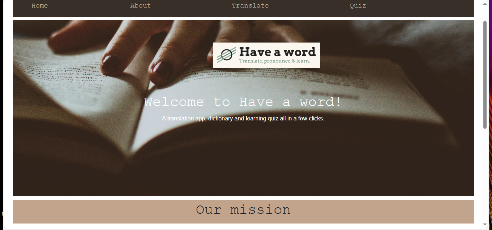
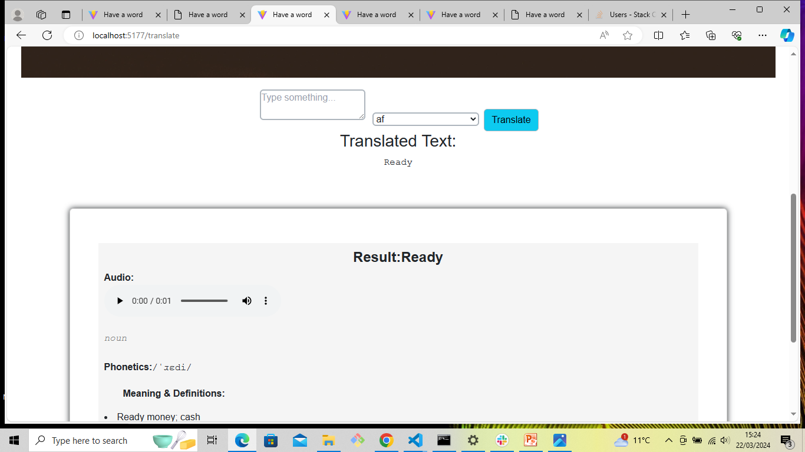
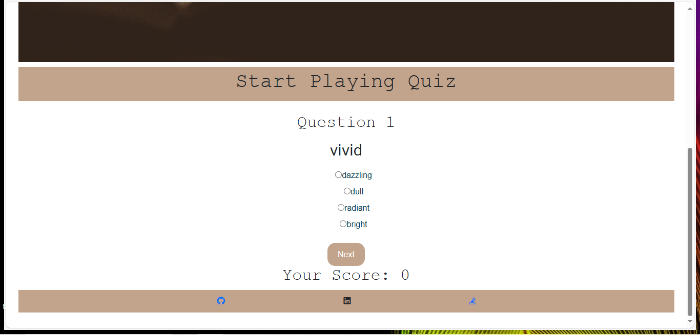
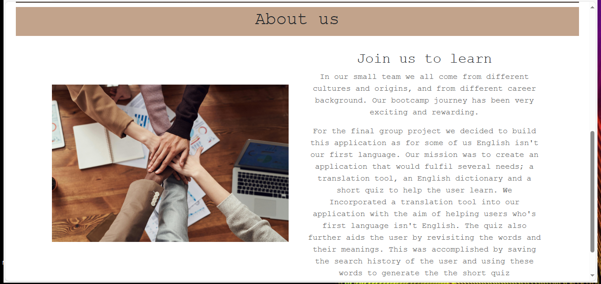

# Project Title: Have-a-word

# Table of Contents:

-[Description] (#Description) -[Installation] (#installation) -[Usage] (#usage) -[License] (#license) -[Contributors] (#Contributors)

# Description:

A combination of Translation, Dictionary and Quiz app

## Have a word Website:

- The Website has header and footer on the homepage. navigation bar on the homepage contains links to the pages. Translate link directs to the tranlate and dictionary page. Quiz link directs to the quiz page and About link directs to the About page where you can find the information

## Translator App:

- This application has list of languages to translate in to english language.
- Enter the language need to translate in to input box select the language from dropdown menu and hit the translate button.
- The translated text will show up in Translated Text area

## Dictionary App:

- This app gives phonetics, meanings & definitions, synonyms, example and audio sound of the given word .
- The translation app and dictionary app has been linked together. The translated text from the translator app will appear straight on the dictionary card with the meanings, synonyms, example and audio.

## Quiz App:

-The Quiz app has a question with multi choice options.
-On selecting the right answer or wrong answer from the options the score changes and new question comes up.

# Installation:

To use this app install below pakages:
axios 1.6.7
google-cloud/translate
bootstrap 5.3.3
vite 5.1.6
react
react-dom
react-router-dom
google-cloud translate Api

# Usage:

This aplication is the single platform where the user can integrate with translation app with options of multiple languages to translate in to english. The dictionary app to get the meaning of the translated word and also included with Quiz to know more about english vocabulary.

# License:

MIT License

# Contributors:

- Michael Baxter
- Almas Mansuri
- Victoria Sugden
- Jeylan Tesi
- Tunde Fol

# App Screenshot:

- Screenshot of Homepage:
  
- Screenshot of Translate and dictionary page
  
- Screenshot of Quiz page
  
- Screenshot of About page
  

# URL of deployed application:

https://havaword.netlify.app/

This template provides a minimal setup to get React working in Vite with HMR and some ESLint rules.

Currently, two official plugins are available:

- [@vitejs/plugin-react](https://github.com/vitejs/vite-plugin-react/blob/main/packages/plugin-react/README.md) uses [Babel](https://babeljs.io/) for Fast Refresh
- [@vitejs/plugin-react-swc](https://github.com/vitejs/vite-plugin-react-swc) uses [SWC](https://swc.rs/) for Fast Refresh
